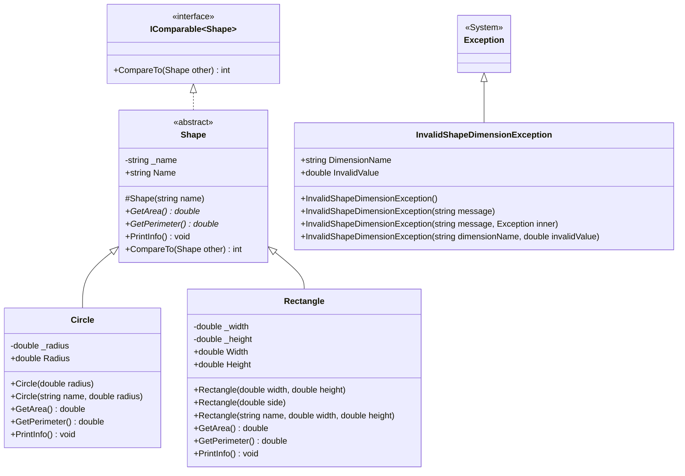

# ЗВІТ ПРО ВИКОНАННЯ ПРАКТИЧНОЇ РОБОТИ №2

**Дисципліна:** Розробка проєктів засобами платформи .NET  
**Тема:** ООП та обробка виключень у консольному застосунку  
**Студент:** №17 за списком групи (Семестровий журнал)  
**Варіант:** №1 («Геометричні фігури»)  
**Навчальний заклад:** Вінницький національний технічний університет (ВНТУ)  
**Рік:** 2026  

---

## 1. Мета роботи
Отримати практичні навички роботи з класами в C# з використанням принципів ООП (інкапсуляція, успадкування, поліморфізм, абстракція), роботи з інтерфейсами (`IComparable<T>`) та коректної обробки виключень (`Exception`).

---

## 2. Завдання варіанта №1 (№17 за списком)
- **Предметна область:** Геометричні фігури.
- **Ієрархія класів:**
  - Базовий абстрактний клас `Shape` з властивістю `Name` та реалізацією інтерфейсу `IComparable<Shape>`.
  - Похідний клас `Circle` з властивістю `Radius`.
  - Похідний клас `Rectangle` з властивостями `Width` та `Height`, включаючи підтримку квадрата як окремого випадку прямокутника.
- **Обов'язкові перевизначення методів:**
  - `GetArea()` (абстрактний у `Shape`):
    - `Circle` $\rightarrow S = \pi \cdot r^2$
    - `Rectangle` $\rightarrow S = a \cdot b$
  - `GetPerimeter()` (абстрактний у `Shape`):
    - `Circle` $\rightarrow P = 2 \cdot \pi \cdot r$
    - `Rectangle` $\rightarrow P = 2 \cdot (a + b)$
  - `PrintInfo()` (віртуальний у `Shape`, перевизначений у похідних класах для виведення специфічних атрибутів фігури).
- **Інкапсуляція:** Приватні поля `_radius`, `_width`, `_height`, `_name` з публічними властивостями та валідацією значень у блоці `set`.
- **Інтерфейс `IComparable<Shape>`:** Реалізація порівняння за площею (`GetArea().CompareTo(other.GetArea())`), що забезпечує впорядкування об'єктів методом `List<Shape>.Sort()`.
- **Поліморфна колекція:** Використання `List<Shape>`, яка зберігає різні екземпляри `Circle` та `Rectangle`, із викликом методів через базовий тип у циклі `foreach`.
- **Власний клас винятку:** `InvalidShapeDimensionException : Exception`, який постачається трьома стандартними конструкторами та викидається при спробі задати недодатні розміри фігур ($\le 0$).
- **Обробка винятків:** Блоки `try { } catch (InvalidShapeDimensionException ex) { } catch (Exception ex) { } finally { }` для безпечної роботи застосунку.
- **Консольне меню:**
  0. Вихід.
  1. Додати фігуру (коло або прямокутник/квадрат) з клавіатури з валідацією.
  2. Показати всі фігури колекції (демонстрація поліморфізму).
  3. Відсортувати фігури за площею (`IComparable<Shape>`).
  4. Показати сумарну площу та периметр колекції.
  5. Фільтрувати фігури за типом (pattern matching `is Circle`, `is Rectangle`).
  6. Демонстрація генерації та перехоплення винятку.
  7. Очистити колекцію (перевірка обробки порожнього списку).
- **Граничні випадки:**
  - Спроба створити фігуру з недодатним розміром сторони чи радіуса ($\le 0$) призводить до генерації `InvalidShapeDimensionException`, який успішно перехоплюється без краху програми.
  - Порожня колекція коректно виводить «Немає даних».

---

## 3. Архітектура та опис реалізації

### 3.1. Діаграма класів (UML Mermaid)



---

## 4. Лістинги коду

### 4.1. Власний виняток (`Exceptions/InvalidShapeDimensionException.cs`)
```csharp
using System;

namespace OopExceptions.Exceptions;

public class InvalidShapeDimensionException : Exception
{
    public string? DimensionName { get; }
    public double InvalidValue { get; }

    public InvalidShapeDimensionException()
        : base("Розмір геометричної фігури має бути строго додатним числом (> 0).")
    {
    }

    public InvalidShapeDimensionException(string message)
        : base(message)
    {
    }

    public InvalidShapeDimensionException(string message, Exception innerException)
        : base(message, innerException)
    {
    }

    public InvalidShapeDimensionException(string dimensionName, double invalidValue)
        : base($"Неприпустимий розмір '{dimensionName}': значення {invalidValue} має бути строго більше нуля (> 0).")
    {
        DimensionName = dimensionName;
        InvalidValue = invalidValue;
    }
}
```

### 4.2. Базовий клас (`Models/Shape.cs`)
```csharp
using System;

namespace OopExceptions.Models;

public abstract class Shape : IComparable<Shape>
{
    private string _name = string.Empty;

    public string Name
    {
        get => _name;
        set
        {
            if (string.IsNullOrWhiteSpace(value))
            {
                throw new ArgumentException("Назва фігури не може бути порожньою.", nameof(value));
            }
            _name = value.Trim();
        }
    }

    protected Shape(string name)
    {
        Name = name;
    }

    public abstract double GetArea();
    public abstract double GetPerimeter();

    public virtual void PrintInfo()
    {
        Console.WriteLine($"Фігура: {Name,-15} | Площа: {GetArea(),8:F2} | Периметр: {GetPerimeter(),8:F2}");
    }

    public int CompareTo(Shape? other)
    {
        if (other is null) return 1;
        return GetArea().CompareTo(other.GetArea());
    }

    public override string ToString() => $"{Name} (S = {GetArea():F2}, P = {GetPerimeter():F2})";
}
```

### 4.3. Клас кола (`Models/Circle.cs`)
```csharp
using System;
using OopExceptions.Exceptions;

namespace OopExceptions.Models;

public class Circle : Shape
{
    private double _radius;

    public double Radius
    {
        get => _radius;
        set
        {
            if (value <= 0)
            {
                throw new InvalidShapeDimensionException("Радіус кола", value);
            }
            _radius = value;
        }
    }

    public Circle(double radius) : base("Коло")
    {
        Radius = radius;
    }

    public Circle(string name, double radius) : base(name)
    {
        Radius = radius;
    }

    public override double GetArea() => Math.PI * Radius * Radius;
    public override double GetPerimeter() => 2 * Math.PI * Radius;

    public override void PrintInfo()
    {
        Console.WriteLine($"[Коло]        Назва: {Name,-10} | Радіус: {Radius,6:F2} | Площа: {GetArea(),8:F2} | Периметр: {GetPerimeter(),8:F2}");
    }
}
```

### 4.4. Клас прямокутника (`Models/Rectangle.cs`)
```csharp
using System;
using OopExceptions.Exceptions;

namespace OopExceptions.Models;

public class Rectangle : Shape
{
    private double _width;
    private double _height;

    public double Width
    {
        get => _width;
        set
        {
            if (value <= 0)
            {
                throw new InvalidShapeDimensionException("Ширина прямокутника", value);
            }
            _width = value;
        }
    }

    public double Height
    {
        get => _height;
        set
        {
            if (value <= 0)
            {
                throw new InvalidShapeDimensionException("Висота прямокутника", value);
            }
            _height = value;
        }
    }

    public Rectangle(double width, double height) : base("Прямокутник")
    {
        Width = width;
        Height = height;
    }

    public Rectangle(double side) : base("Квадрат")
    {
        Width = side;
        Height = side;
    }

    public Rectangle(string name, double width, double height) : base(name)
    {
        Width = width;
        Height = height;
    }

    public override double GetArea() => Width * Height;
    public override double GetPerimeter() => 2 * (Width + Height);

    public override void PrintInfo()
    {
        Console.WriteLine($"[Прямокутник] Назва: {Name,-10} | {Width:F2} x {Height:F2,-5} | Площа: {GetArea(),8:F2} | Периметр: {GetPerimeter(),8:F2}");
    }
}
```

### 4.5. Головна програма (`Program.cs`)
*(Повний код дивіться у репозиторії в файлі `02-oop-exceptions/Program.cs`)*.

---

## 5. Приклади роботи програми (Консольний вивід)

### 5.1. Поліморфне виведення фігур різного типу
```text
=======================================================
    Практична робота №2 | Варіант 1 (№17 у списку)   
         Геометричні фігури (ООП та виключення)        
=======================================================
1. Додати фігуру (коло або прямокутник)
2. Показати всі фігури колекції (поліморфний вивід)
3. Відсортувати фігури за площею (IComparable<Shape>)
4. Показати сумарну площу та сумарний периметр
5. Фільтрувати фігури за типом (pattern matching 'is')
6. Продемонструвати обробку винятку InvalidShapeDimensionException
7. Очистити колекцію (перевірка порожнього списку)
0. Вихід
-------------------------------------------------------
Ваш вибір: 2

--- Список усіх фігур у колекції (демонстрація поліморфізму) ---
Усього фігур у колекції: 5

 1. [Коло]        Назва: Мале коло  | Радіус:   3.00 | Площа:    28.27 | Периметр:    18.85
 2. [Прямокутник] Назва: Прямокутник А | 4.00 x 5.00  | Площа:    20.00 | Периметр:    18.00
 3. [Коло]        Назва: Велике коло | Радіус:   7.00 | Площа:   153.94 | Периметр:    43.98
 4. [Прямокутник] Назва: Квадрат    | 6.00 x 6.00  | Площа:    36.00 | Периметр:    24.00
 5. [Прямокутник] Назва: Пластина   | 2.50 x 8.00  | Площа:    20.00 | Периметр:    21.00
```

### 5.2. Сортування фігур за площею (`IComparable<Shape>`)
```text
Ваш вибір: 3

--- Сортування фігур за площею (IComparable<Shape>) ---
[Успішно] Колекцію відсортовано за зростанням площі:

 1. Прямокутник А   | Площа:    20.00 | Периметр:    18.00
 2. Пластина        | Площа:    20.00 | Периметр:    21.00
 3. Мале коло       | Площа:    28.27 | Периметр:    18.85
 4. Квадрат         | Площа:    36.00 | Периметр:    24.00
 5. Велике коло     | Площа:   153.94 | Периметр:    43.98
```

### 5.3. Перехоплення та обробка власного винятку `InvalidShapeDimensionException`
```text
Ваш вибір: 6

--- Демонстрація генерації та перехоплення винятку ---
Спробуємо навмисно створити коло з радіусом -5.0 та прямокутник з висотою 0:

[Спроба 1] new Circle(-5.0)...
-> Успішно перехоплено InvalidShapeDimensionException: Неприпустимий розмір 'Радіус кола': значення -5 має бути строго більше нуля (> 0).
-> Виконано блок finally для Спроби 1.

[Спроба 2] new Rectangle(10.0, 0.0)...
-> Успішно перехоплено InvalidShapeDimensionException: Неприпустимий розмір 'Висота прямокутника': значення 0 має бути строго більше нуля (> 0).
-> Виконано блок finally для Спроби 2.

Як бачимо, програма не завершилась аварійно, а коректно обробила виняткові ситуації.
```

---

## 6. Посилання на GitHub-репозиторій
- **URL репозиторію:** `https://github.com/<ваш_аккаунт>/dotnet-labs-<прізвище>`
- **Папка проєкту:** `/02-oop-exceptions`

---

## 7. Відповіді на контрольні питання

**1. У чому різниця між абстрактним класом та інтерфейсом? Коли що застосовувати?**  
*Відповідь:* Абстрактний клас задає сутність типу («is-a» зв'язок), може містити реалізацію методів, стан (поля), конструктори й модифікатори доступу, але клас у C# може успадкувати лише один базовий клас. Інтерфейс задає контракт поведінки («can-do» зв'язок), клас може реалізовувати множинні інтерфейси. Абстрактний клас використовують для споріднених сутностей зі спільним кодом та станом; інтерфейс — для визначення спільних можливостей між різнорідними типами (наприклад, `IComparable`, `IDisposable`).

**2. Навіщо потрібна інкапсуляція і чому властивість з валідацією в `set` краще за публічне поле?**  
*Відповідь:* Інкапсуляція приховує внутрішній стан об'єкта та захищає його інваріанти від некоректних змін ззовні. Публічне поле дозволяє встановити будь-яке значення (наприклад, від'ємний радіус). Властивість із валідацією в блоці `set` перевіряє значення перед записом та у разі помилки викидає виняток, гарантуючи валідність об'єкта.

**3. Навіщо потрібне перевантаження конструкторів, якщо можна обійтися одним конструктором з параметрами за замовчуванням?**  
*Відповідь:* Перевантаження дозволяє створити кілька семантично різних способів ініціалізації об'єкта з різним набором параметрів (наприклад, `Rectangle(side)` для квадрата та `Rectangle(w, h)` для прямокутника), покращує зворотну сумісність публічного API у бібліотеках і не зашиває значення за замовчуванням у бінарний код клієнта.

**4. Як реалізується поліморфізм у C# на рівні виконання (пізнє зв'язування)? Наведіть приклад із власної ієрархії.**  
*Відповідь:* Через механізм віртуальних таблиць методів (vtable). При виклику `shape.GetArea()`, де `shape` має тип `Shape`, CLR під час виконання звертається до vtable фактичного екземпляра об'єкта в купі (`Circle` або `Rectangle`) та викликає відповідний перевизначений `override`-метод.

**5. У чому різниця між `abstract`-методом і `virtual`-методом з реалізацією за замовчуванням?**  
*Відповідь:* `abstract`-метод не має власного тіла в базовому класі та є обов'язковим для реалізації в кожному неабстрактному похідному класі. `virtual`-метод містить базову реалізацію за замовчуванням, яку похідні класи можуть або перевизначити за бажанням, або залишити без змін.

**6. Для чого призначений інтерфейс `IComparable<T>` і як його реалізація впливає на роботу `List<T>.Sort()`?**  
*Відповідь:* `IComparable<T>` визначає метод `CompareTo(T other)`, що встановлює природний порядок сортування для власного типу. Метод `List<T>.Sort()` автоматично використовує `CompareTo` для порівняння пар елементів алгоритмом сортування без необхідності передавати сторонні компаратори.

**7. Що виконується у блоці `finally` і в яких випадках це критично важливо?**  
*Відповідь:* Блок `finally` виконується завжди — незалежно від того, стався виняток у блоці `try`, чи ні, і навіть якщо з блоку було виконано `return`. Це критично важливо для гарантованого звільнення некерованих ресурсів (закриття файлів, дескрипторів мережевих з'єднань, транзакцій).

**8. У чому різниця між обробкою винятку в `catch (SpecificException)` і `catch (Exception)`? Чому порядок гілок `catch` має значення?**  
*Відповідь:* `catch (SpecificException)` обробляє конкретний очікуваний тип помилки, даючи змогу вжити точкових дій. `catch (Exception)` перехоплює взагалі будь-який виняток. Гілки перевіряються зверху вниз: якщо поставити `catch (Exception)` першим, конкретні обробники ніколи не спрацюють, тому порядок має бути від найспецифічнішого до найбільш загального.

**9. Навіщо створювати власні класи винятків, якщо є вбудовані (`ArgumentException`, `InvalidOperationException` тощо)?**  
*Відповідь:* Власний виняток чітко ідентифікує бізнес-помилку предметної області, дозволяє додати специфічні поля (наприклад, назву виміру та некоректне значення в `InvalidShapeDimensionException`) і дає змогу зовнішньому коду перехоплювати лише помилки даного домену без перехоплення загальних системних винятків.

**10. Чому власний клас винятку прийнято постачати трьома стандартними конструкторами?**  
*Відповідь:* Згідно з шаблонами проектування .NET Framework (Framework Design Guidelines), це забезпечує повну сумісність: конструктор без параметрів — для стандартного повідомлення; конструктор з `string message` — для довільного тексту; конструктор з `(string message, Exception innerException)` — для збереження вихідного винятку при ланцюжковому загортанні помилок.

**11. Що станеться, якщо колекція базового типу (`List<Shape>`) міститиме похідний об'єкт, а виклик методу не позначено `virtual`/`override`? Чим це відрізняється від коректної поліморфної поведінки?**  
*Відповідь:* Викличеться метод базового класу `Shape` (раннє зв'язування на етапі компіляції), а реалізація похідного класу буде проігнорована. Коректний поліморфізм (`virtual`/`override`) гарантує виклик коду похідного класу навіть тоді, коли звернення відбувається через змінну базового типу.

**12. Чому колекцію об'єктів ієрархії варто типізувати базовим класом (`List<Shape>`), а не окремими списками для кожного похідного типу?**  
*Відповідь:* Типізація базовим класом реалізує принцип відкритості/закритості (OCP) та поліморфізм: дає змогу зберігати й обробляти фігури будь-яких типів в єдиному циклі, сортувати їх разом та додавати нові похідні класи (наприклад, `Triangle`) без зміни коду обробки та інтерфейсу користувача.

---

## 8. Висновки
Під час виконання практичної роботи №2 було успішно спроєктовано та реалізовано об'єктно-орієнтовану ієрархію геометричних фігур мовою C# на платформі .NET 10. У проєкті повною мірою втілено фундаментальні принципи ООП: абстракцію (клас `Shape`), успадкування (`Circle`, `Rectangle`), поліморфізм (віртуальні та абстрактні методи) та інкапсуляцію (захист полів через валідовані властивості). Реалізація інтерфейсу `IComparable<Shape>` дозволила впорядковувати колекцію за площею, а розробка власного класу винятку `InvalidShapeDimensionException` із блоками `try-catch-finally` забезпечила надійне реагування застосунку на некоректні розміри фігур.
