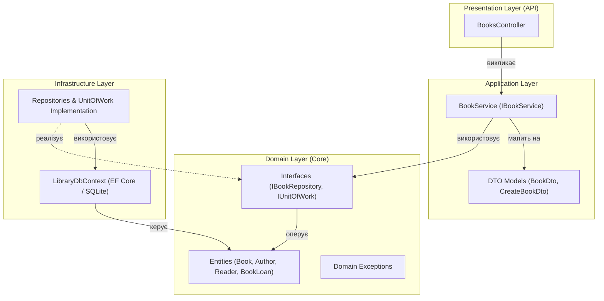

# ЗВІТ ПРО ПРАКТИЧНУ РОБОТУ №8
**Дисципліна:** Розробка проєктів засобами платформи .NET  
**Тема:** Архітектурні патерни та тестування .NET-застосунку  
**Номер варіанта:** Варіант 1 (Студент №17 за журналом)  
**Предметна область:** «Бібліотека» (Library Management System: книги, автори, читачі, формуляри видачі)  

---

## 1. Мета роботи
Опанувати практичні навички проєктування архітектури enterprise-застосунків на платформі .NET з використанням принципів Чистої Архітектури (Clean Architecture / Onion Architecture), шаблонів проєктування **Repository** та **Unit of Work**, розшарування бізнес-логіки у виділений сервісний шар, а також реалізувати всебічне автоматизоване тестування:
1. Модульне тестування (Unit Testing) сервісного шару з ізоляцією залежностей за допомогою **xUnit** та **Moq**.
2. Інтеграційне тестування (Integration Testing) кінцевих точок Web API за допомогою **WebApplicationFactory** та реального тестового HTTP-клієнта.

---

## 2. Завдання варіанту
1. **Рефакторинг архітектури проєкту:**
   - Повністю ізолювати шар доступу до даних (`DbContext`) від презентаційного шару (контролерів).
   - Реалізувати патерн **Repository** для сутностей бібліотеки (`IBookRepository`, `IAuthorRepository`).
   - Реалізувати патерн **Unit of Work** (`IUnitOfWork`) для гарантування атомарності операцій збереження змін кількох репозиторіїв у межах єдиної транзакції.
   - Винести бізнес-логіку та бізнес-правила з контролерів у спеціалізований сервісний шар (`IBookService`, `BookService`).
2. **Розподіл на шари (Clean Architecture):**
   - **Domain:** Сутності (`Author`, `Book`, `Reader`, `BookLoan`), інтерфейси сховищ, доменні винятки (`EntityNotFoundException`, `BusinessRuleValidationException`). Шар не має жодних зовнішніх залежностей.
   - **Application:** DTO-моделі (`BookDto`, `CreateBookDto`, `UpdateBookDto`), інтерфейси та реалізації сервісів (`IBookService`, `BookService`).
   - **Infrastructure:** Реалізація `LibraryDbContext` (EF Core SQLite), конкретні класи репозиторіїв (`BookRepository`, `AuthorRepository`, `UnitOfWork`).
   - **Presentation (API):** Тонкі REST-контролери (`BooksController`), які приймають HTTP-запити, транслюють їх у виклики сервісного шару та повертають стандартизовані HTTP-відповіді.
3. **Модульне тестування (Unit Testing):**
   - Написати щонайменше 6 тестів (реалізовано 8) на базі `xUnit` та `Moq`.
   - Покрити позитивні та негативні сценарії (читання, створення, валідація наявності автора, оновлення, видалення, помилки `EntityNotFoundException` та `BusinessRuleValidationException`).
4. **Інтеграційне тестування (Integration Testing):**
   - Написати інтеграційні тести за допомогою `WebApplicationFactory<Program>` для ендпоінтів `/api/books`.
   - Перевірити повернення статусів HTTP `200 OK`, `201 Created`, `400 Bad Request`, `404 Not Found`.

---

## 3. Архітектурна схема Clean Architecture та напрямок залежностей



### Принцип інверсії залежностей (Dependency Inversion Principle)
- Ядром системи є **Domain Layer**, що містить чисті бізнес-сутності та інтерфейси. Він не посилається на жодні зовнішні бібліотеки (ні EF Core, ні ASP.NET Core).
- **Application Layer** залежить виключно від **Domain Layer**. Сервіси оперують інтерфейсами `IUnitOfWork` та `IBookRepository`.
- **Infrastructure Layer** реалізує інтерфейси, оголошені в Domain, та інкапсулює специфіку роботи з базою даних SQLite через EF Core.
- **Presentation Layer (Api)** залежить від Application та Domain для прив'язки моделей та налаштування контейнера впровадження залежностей (IoC Container).

---

## 4. Структура реалізації проєкту

### 4.1. Доменні сутності та інтерфейси (`Domain`)

#### Сутності (`Domain/Entities/LibraryEntities.cs`)
```csharp
public class Book
{
    public int Id { get; set; }
    public string Title { get; set; } = string.Empty;
    public string ISBN { get; set; } = string.Empty;
    public int PublicationYear { get; set; }
    public string Genre { get; set; } = string.Empty;

    public int AuthorId { get; set; }
    public Author? Author { get; set; }

    public ICollection<BookLoan> BookLoans { get; set; } = new List<BookLoan>();
}
```

#### Інтерфейси репозиторіїв та Unit of Work (`Domain/Interfaces/IRepositories.cs`)
```csharp
public interface IBookRepository
{
    Task<IReadOnlyList<Book>> GetAllAsync();
    Task<Book?> GetByIdAsync(int id);
    Task AddAsync(Book book);
    void Update(Book book);
    void Delete(Book book);
}

public interface IAuthorRepository
{
    Task<bool> ExistsAsync(int id);
    Task<Author?> GetByIdAsync(int id);
}

public interface IUnitOfWork : IDisposable
{
    IBookRepository Books { get; }
    IAuthorRepository Authors { get; }
    Task<int> SaveChangesAsync();
}
```

---

### 4.2. Сервісний шар бізнес-логіки (`Application/Services/BookService.cs`)
Сервіс інкапсулює бізнес-правила (перевірку обов'язкової наявності автора книги перед збереженням) та трансляцію доменних сутностей у DTO.
```csharp
public class BookService : IBookService
{
    private readonly IUnitOfWork _unitOfWork;

    public BookService(IUnitOfWork unitOfWork)
    {
        _unitOfWork = unitOfWork;
    }

    public async Task<BookDto> CreateBookAsync(CreateBookDto dto)
    {
        ArgumentNullException.ThrowIfNull(dto);

        // Бізнес-правило: Перевірка існування автора перед створенням книги
        bool authorExists = await _unitOfWork.Authors.ExistsAsync(dto.AuthorId);
        if (!authorExists)
        {
            throw new BusinessRuleValidationException($"Автора з Id={dto.AuthorId} не знайдено в базі даних.");
        }

        var book = new Book
        {
            Title = dto.Title,
            ISBN = dto.ISBN,
            PublicationYear = dto.PublicationYear,
            Genre = dto.Genre,
            AuthorId = dto.AuthorId
        };

        await _unitOfWork.Books.AddAsync(book);
        await _unitOfWork.SaveChangesAsync();

        var author = await _unitOfWork.Authors.GetByIdAsync(dto.AuthorId);
        book.Author = author;

        return MapToDto(book);
    }
    // ... реалізація GetAll, GetById, Update, Delete
}
```

---

### 4.3. Інфраструктурний шар (`Infrastructure/Repositories/Repositories.cs`)
```csharp
public class UnitOfWork : IUnitOfWork
{
    private readonly LibraryDbContext _context;
    private IBookRepository? _books;
    private IAuthorRepository? _authors;

    public UnitOfWork(LibraryDbContext context) => _context = context;

    public IBookRepository Books => _books ??= new BookRepository(_context);
    public IAuthorRepository Authors => _authors ??= new AuthorRepository(_context);

    public async Task<int> SaveChangesAsync() => await _context.SaveChangesAsync();

    public void Dispose()
    {
        _context.Dispose();
        GC.SuppressFinalize(this);
    }
}
```

---

### 4.4. Тонкий контролер Web API (`Controllers/BooksController.cs`)
Контролер не має жодного зв'язку з `DbContext` чи SQL-базою. Він оперує виключно сервісним інтерфейсом `IBookService` та транслює доменні винятки у стандартні коди помилок HTTP:
```csharp
[ApiController]
[Route("api/[controller]")]
public class BooksController : ControllerBase
{
    private readonly IBookService _bookService;

    public BooksController(IBookService bookService) => _bookService = bookService;

    [HttpGet]
    public async Task<ActionResult<IReadOnlyList<BookDto>>> GetAll() =>
        Ok(await _bookService.GetAllBooksAsync());

    [HttpPost]
    public async Task<ActionResult<BookDto>> Create([FromBody] CreateBookDto dto)
    {
        try
        {
            var created = await _bookService.CreateBookAsync(dto);
            return CreatedAtAction(nameof(GetById), new { id = created.Id }, created);
        }
        catch (BusinessRuleValidationException ex)
        {
            return BadRequest(new { error = ex.Message });
        }
    }
}
```

---

## 5. Модульне та інтеграційне тестування

### 5.1. Модульні тести з Moq (`BookServiceTests.cs`)
Сервіс `BookService` тестується в повній ізоляції від фізичної бази даних завдяки симуляції поведінки репозиторіїв та `IUnitOfWork`.

| № | Метод тесту | Що перевіряє (Сценарій) | Очікуваний результат |
|---|---|---|---|
| 1 | `GetAllBooksAsync_WhenBooksExist_ReturnsListOfBookDtos` | Отримання колекції всіх книг через репозиторій | Повертає список DTO з коректними даними автора |
| 2 | `GetBookByIdAsync_WhenBookExists_ReturnsBookDto` | Пошук книги за існуючим первинним ключем | Повертає відповідний DTO об'єкт |
| 3 | `GetBookByIdAsync_WhenBookDoesNotExist_ThrowsEntityNotFoundException` | Пошук неіснуючої книги | Викликає виняток `EntityNotFoundException` |
| 4 | `CreateBookAsync_WhenAuthorExists_CreatesAndReturnsBookDto` | Створення книги з валідним автором | Книга додається, викликається `SaveChangesAsync`, повертається DTO |
| 5 | `CreateBookAsync_WhenAuthorDoesNotExist_ThrowsBusinessRuleValidationException` | Створення книги з неіснуючим автором | Викликає `BusinessRuleValidationException`, транзакція блокується |
| 6 | `UpdateBookAsync_WhenBookAndAuthorExist_UpdatesBookAndSavesChanges` | Оновлення полів існуючої книги | Викликається метод оновлення та збереження змін |
| 7 | `DeleteBookAsync_WhenBookExists_DeletesBookAndSavesChanges` | Видалення існуючої книги | Викликається `Delete` і `SaveChangesAsync` |
| 8 | `DeleteBookAsync_WhenBookDoesNotExist_ThrowsEntityNotFoundException` | Спроба видалення неіснуючої книги | Викликає `EntityNotFoundException`, видалення блокується |

#### Приклад модульного тесту з перевіркою викликів Moq:
```csharp
[Fact]
public async Task CreateBookAsync_WhenAuthorDoesNotExist_ThrowsBusinessRuleValidationException()
{
    // Arrange (Підготовка)
    var dto = new CreateBookDto { Title = "Книга", AuthorId = 999 };
    _mockAuthorRepo.Setup(a => a.ExistsAsync(999)).ReturnsAsync(false);

    // Act & Assert (Виклик та перевірка винятку)
    var ex = await Assert.ThrowsAsync<BusinessRuleValidationException>(() => _bookService.CreateBookAsync(dto));
    Assert.Contains("999", ex.Message);

    // Перевірка (Verify): методи додавання та збереження не викликалися
    _mockBookRepo.Verify(b => b.AddAsync(It.IsAny<Book>()), Times.Never);
    _mockUnitOfWork.Verify(u => u.SaveChangesAsync(), Times.Never);
}
```

---

### 5.2. Інтеграційні тести з WebApplicationFactory (`BookApiIntegrationTests.cs`)
Тестується реальна робота ASP.NET Core конвеєра (маршрутизація, серіалізація JSON, валідація, DI) без необхідності підняття зовнішнього веб-сервера.

| № | Метод тесту | Ендпоінт | Перевірка |
|---|---|---|---|
| 1 | `GetAllBooks_ReturnsSuccessStatusCodeAndJsonArray` | `GET /api/books` | Код 200 OK, непорожній JSON масив |
| 2 | `GetBookById_WhenBookExists_ReturnsOkAndBookDetails` | `GET /api/books/1` | Код 200 OK, книга «Кобзар» |
| 3 | `GetBookById_WhenBookDoesNotExist_ReturnsNotFound` | `GET /api/books/9999` | Код 404 Not Found |
| 4 | `CreateBook_WithValidData_ReturnsCreated` | `POST /api/books` | Код 201 Created, повертає створену сутність |
| 5 | `CreateBook_WithNonExistentAuthor_ReturnsBadRequest` | `POST /api/books` | Код 400 Bad Request при неіснуючому авторі |

---

## 6. Відповіді на контрольні питання

### 1. Яку проблему вирішує патерн Repository і чому це полегшує тестування бізнес-логіки?
**Відповідь:**  
Патерн **Repository** інкапсулює логіку роботи з рівнем персистентності даних (доступ до бази даних, побудова запитів LINQ/SQL, кешування).
- **Проблема, яку він вирішує:** Без репозиторію контролери або сервіси безпосередньо звертаються до `DbContext` чи SQL-драйверів, що призводить до жорсткої зв'язності (tight coupling) між бізнес-логікою та конкретною СУБД.
- **Полегшення тестування:** Завдяки інтерфейсу (`IBookRepository`), бізнес-логіку можна протестувати у повній ізоляції за допомогою інструментів мокування (Moq/NSubstitute). Мок-об'єкт замінює реальний доступ до БД миттєвим поверненням даних із пам'яті, що робить unit-тести надзвичайно швидкими, стабільними та незалежними від наявності зв'язку з базою даних.

---

### 2. У чому призначення Unit of Work і чим він відрізняється від окремих незалежних репозиторіїв?
**Відповідь:**  
- **Призначення:** Шаблон **Unit of Work** забезпечує підтримку транзакційної цілісності (ACID) під час виконання операцій, що зачіпають декілька різних репозиторіїв. Він веде облік усіх змін (створення, редагування, видалення) і гарантує, що вони будуть або збережені в базі даних одночасно в межах єдиної транзакції через спільний виклик `SaveChangesAsync()`, або скасовані (rollback) у разі помилки.
- **Відмінність від окремих репозиторіїв:** Якщо кожен репозиторій самостійно викликатиме `SaveChanges()`, то операція, яка створює книгу і списує екземпляр у формулярі видачі, може зберегти першу сутність і впасти на другій, спричинивши розрив узгодженості даних. `Unit of Work` об'єднує всі репозиторії навколо єдиного контексту (`DbContext`).

---

### 3. Чим unit-тест принципово відрізняється від інтеграційного тесту? Наведіть приклад кожного для цього проєкту.
**Відповідь:**  
- **Unit-тест (модульний тест):** Перевіряє роботу одного ізольованого компонента (класу чи методу) у повній ізоляції від зовнішнього середовища (БД, файлової системи, мережі, HTTP-контексту). Усі зовнішні залежності замінюються заглушками (Mocks/Stubs). Працює за частки мілісекунди.
  - *Приклад у проєкті:* Метод `CreateBookAsync_WhenAuthorDoesNotExist_ThrowsBusinessRuleValidationException`, де `IUnitOfWork` та репозиторії змоковані за допомогою Moq, перевіряючи лише правильність спрацювання перевірки правила в `BookService`.
- **Інтеграційний тест:** Перевіряє взаємодію декількох взаємопов'язаних компонентів системи між собою (конвеєр ASP.NET Core, routing, model binding, валідація, DI-контейнер, реальна БД або in-memory база).
  - *Приклад у проєкті:* Метод `CreateBook_WithValidData_ReturnsCreated` за допомогою `WebApplicationFactory<Program>`, що відправляє реальний HTTP POST-запит, проходить весь стек middleware, звертається до SQLite-бази та перевіряє код статусу `201 Created`.

---

### 4. Навіщо в unit-тестах сервісного шару мокати репозиторії, а не використовувати реальну базу даних?
**Відповідь:**  
1. **Швидкість:** Тести на реальній БД витрачають час на відкриття сокетів, I/O операції та ініціалізацію з'єднання. Моки в пам'яті виконуються за частки мілісекунд, що дозволяє запускати сотні й тисячі тестів під час кожної збірки CI/CD.
2. **Ізоляція та повторюваність (Determinism):** Реальна БД містить стан, який може змінюватися попередніми тестами або зовнішніми факторами. Мок завжди повертає строго детермінований результат, заданий у секції `Arrange`.
3. **Незалежність від інфраструктури:** Тести можуть запускатися на будь-якій машині без необхідності піднятого сервера баз даних, міграцій або конфігураційних файлів доступу.
4. **Можливість емуляції збоїв:** Легко протестувати обробку помилок мережі або винятків тайм-ауту (`Setup(...).ThrowsAsync(...)`), що важко штучно спровокувати на реальній базі даних.

---

### 5. Який основний принцип Clean Architecture визначає напрямок залежностей між шарами (Domain, Application, Infrastructure, Api)?
**Відповідь:**  
Основним принципом є **Правило Залежностей (The Dependency Rule)**:
> *"Залежності вихідного коду можуть бути спрямовані тільки всередину — до шарів із вищим рівнем абстракції (до Домену)".*

- **Domain** знаходиться в центрі архітектурного кола і не залежить ні від чого.
- **Application** залежить тільки від Domain.
- **Infrastructure** та **Presentation (Api)** знаходяться на зовнішніх колах і залежать від внутрішніх шарів (Application та Domain).
- Завдяки **інверсії залежностей (DIP з SOLID)**, високорівнева бізнес-логіка не залежить від деталей реалізації низькорівневих модулів (наприклад, яка СУБД використовується — SQLite, PostgreSQL чи SQL Server; яку бібліотеку обрано для ORM тощо).

---

### 6. Як WebApplicationFactory дозволяє тестувати Web API «end-to-end» без розгортання окремого сервера?
**Відповідь:**  
`WebApplicationFactory<TEntryPoint>` (з бібліотеки `Microsoft.AspNetCore.Mvc.Testing`):
1. Запускає веб-застосунок безпосередньо у пам'яті тестового процесу за допомогою тестового сервера `TestServer`.
2. Повністю створює та ініціалізує конвеєр обробки запитів (Middleware pipeline), конфігурацію, DI-контейнер та маршрутизацію.
3. Надає метод `factory.CreateClient()`, який повертає налаштований екземпляр `HttpClient`. Запити, що відправляються через цей клієнт, потрапляють у `TestServer` безпосередньо через пам'ять (in-memory pipeline) без звернення до фізичних мережевих сокетів ОС чи відкриття TCP-портів.
4. Дозволяє перехоплювати та підміняти конфігурацію сервісів через метод `WithWebHostBuilder()`, наприклад, для підключення ізольованої тестової бази даних замість продакшн-конфігурації.

---

## 7. Висновки
У процесі виконання практичної роботи №8 було здійснено комплексний архітектурний рефакторинг веб-застосунку «Бібліотека» відповідно до канонів Clean Architecture. Було розділено обов'язки між шарами Domain, Application, Infrastructure та Presentation, а також усунуто пряму залежність контролерів від `DbContext` за допомогою патернів Repository та Unit of Work. Розроблено набір із 8 модульних тестів із використанням `xUnit` та `Moq`, що перевіряють роботу бізнес-правил в ізоляції, та набір із 5 інтеграційних тестів із `WebApplicationFactory`, які підтверджують коректне функціонування REST API наскрізно через HTTP-конвеєр.
